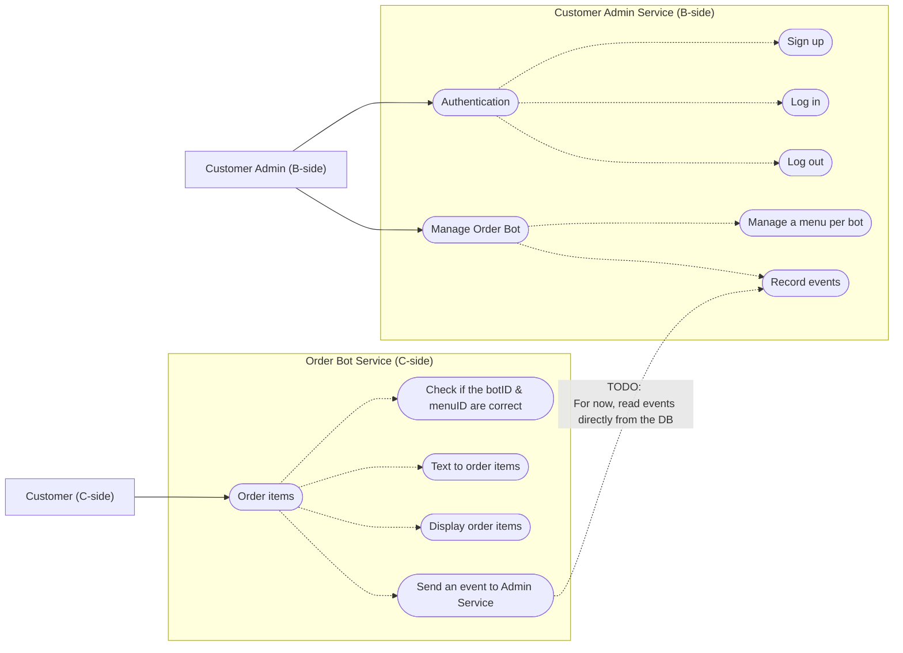

# order-bot

> A full-stack text-to-order chatbot demo app that allows: <br>
> - B-side users to manage the order bot's menu and review orders from the admin side. <br>
> - C-side users to place orders by texting with the order bot

<br>

## Features (Use Case Diagram)


<br>

## Modules
### `order-bot-mgmt-svc`
* Go-based management service for B-side (admin) operations.
* Stack:
  * net/http
  * Gin
  * GORM

### `order-bot-svc`
* Python-based C-side order bot service.
* Stack:
  * FastAPI
  * SQLAlchemy
  * LangChain
  * MCP

### `order-bot-frontend`
* Vue 3 + Vite frontend for user interaction.

### `infra-terraform`
* Terraform-based infrastructure definitions to deploy the app in the AWS Cloud.
* Beside the EventBridge schedules, Lambda functions, and VPC-related settings, all the other 
  settings are defined in this module.
* Infrastructure Architecture: 
  * [architecture.md](./infra-terraform/docs/architecture.md)
  * [start_flow.md](./infra-terraform/docs/start_flow.md)

## How to run the app in local environment
1. **Build service images from each service Dockerfile** (or let Compose build automatically):
   * `order-bot-mgmt-svc/Dockerfile`
   * `order-bot-svc/Dockerfile`
2. **Run Docker Compose from the repository root**:
   ```bash
   docker compose up --build -d
   ```
3. **Create two PostgreSQL schemas**:
   * `order_bot`
   * `order_bot_mgmt`

   Example:
   ```sql
   CREATE SCHEMA IF NOT EXISTS order_bot;
   CREATE SCHEMA IF NOT EXISTS order_bot_mgmt;
   ```
4. **Run DDL files to create tables**:
   * `ddl/order_bot_ddl.sql`
   * `ddl/order_bot_mgmt_ddl.sql`

   Example:
   ```bash
   psql -h <host> -U <user> -d <database> -f ddl/order_bot_ddl.sql
   psql -h <host> -U <user> -d <database> -f ddl/order_bot_mgmt_ddl.sql
   ```

<br>


## ER-Diagram
* [order-bot-mgmt-svc-erd](./doc/order-bot-mgmt-svc-erd.md)
* [order-bot-svc-erd](./doc/order-bot-svc-erd.md)

<br>

## TODO (Relatively critical features that need to be added)

* `order-bot-mgmt-svc`
  * The service does create access tokens and refresh tokens, but there is no 
  token refresh mechanism for now.
  * The implementation of Dependency Isolation is a bit messy. The related structure still needs 
    to be refactored.
* `order-bot-svc`
  * More MCP tools need to be added to allow the bot to provide more types of response for a better user experience
  * The output model to retrieve the response from the MCP tool still need to be refactored
* `order-bot-frontend`
  * The UI layout is off on mobile browsers
  * The C-side URL can't be copied after clicking the URL generation button on a mobile browser
  * The order data on the dialog page is not rendered yet. It's shown in plain JSON format.
* `infra-terraform`
  * There is still an issue with the cache of AWS CloudFront.
  * Clients may get stale cache files after re-uploading files to linked S3 buckets
