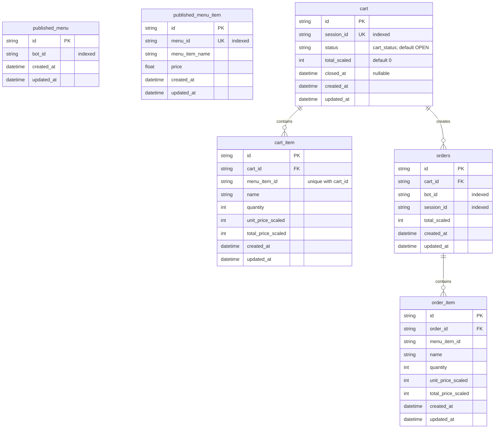

# ER-Diagram: order-bot-svc

`created_at` and `updated_at` are inherited from `BaseModel`. The diagram includes only relationships enforced by `ForeignKey` declarations; menu-related identifier columns are not foreign keys in the current model.
