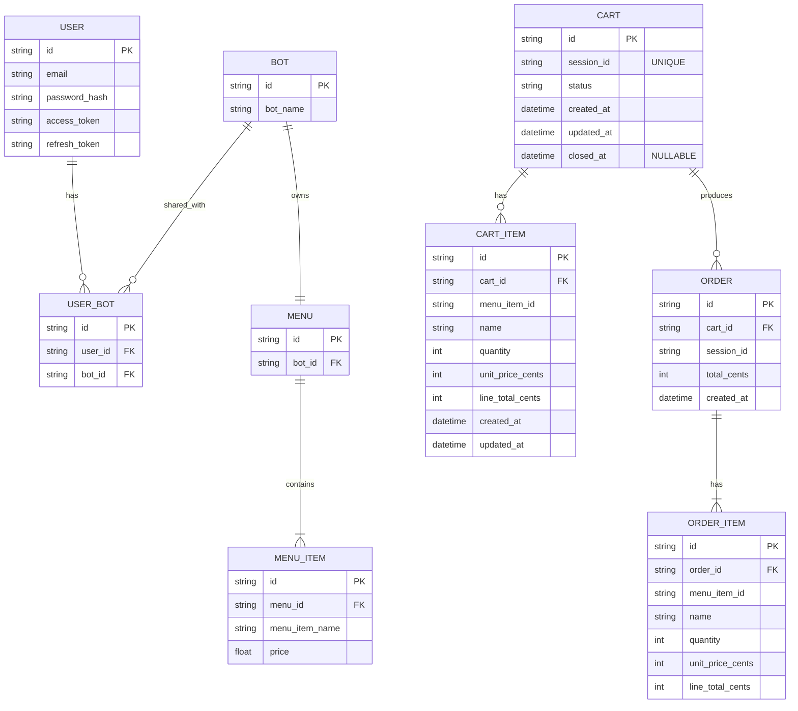

# ER-Diagram

```mermaid
erDiagram
  %% =========================
  %% order-bot-mgmt-svc
  %% =========================
  USER {
    string id PK
    string email
    string password_hash
    string access_token
    string refresh_token
  }

  USER_BOT {
    string id PK
    string user_id FK
    string bot_id FK
  }

  BOT {
    string id PK
    string bot_name
  }

  MENU {
    string id PK
    string bot_id FK
  }

  MENU_ITEM {
    string id PK
    string menu_id FK
    string menu_item_name
    float  price
  }

  USER ||--o{ USER_BOT : has
  BOT  ||--o{ USER_BOT : shared_with
  BOT  ||--|| MENU : owns
  MENU ||--|{ MENU_ITEM : contains

  %% =========================
  %% order-bot-svc
  %% =========================
  CART {
    string   id PK
    string   session_id "UNIQUE"
    string   status
    datetime created_at
    datetime updated_at
    datetime closed_at "NULLABLE"
  }

  CART_ITEM {
    string   id PK
    string   cart_id FK
    string   menu_item_id
    string   name
    int      quantity
    int      unit_price_cents
    int      line_total_cents
    datetime created_at
    datetime updated_at
    %% UNIQUE(cart_id, menu_item_id)
  }

  "ORDER" {
    string   id PK
    string   cart_id FK
    string   session_id
    int      total_cents
    datetime created_at
  }

  ORDER_ITEM {
    string id PK
    string order_id FK
    string menu_item_id
    string name
    int    quantity
    int    unit_price_cents
    int    line_total_cents
  }

  CART  ||--o{ CART_ITEM : has
  CART  ||--o{ "ORDER"   : produces
  "ORDER" ||--|{ ORDER_ITEM : has

  %% NOTE: In your Python models, cart_id/order_id reference "carts.id"/"orders.id".
  %% Also, menu_item_id in CartItem/OrderItem is stored as a string (no FK declared),
  %% so it's modeled as an attribute, not a relationship here.

```
