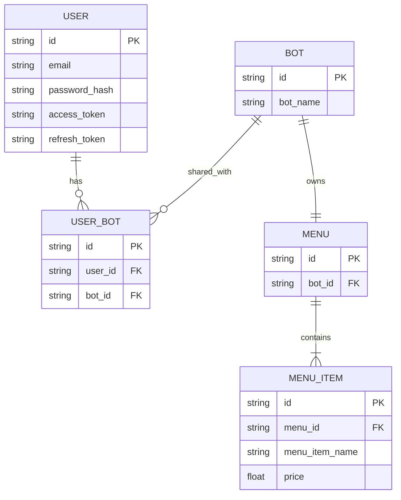

# ER-Diagram: order-bot-mgmt-svc

```mermaid
erDiagram
  %% =========================
  %% order-bot-mgmt-svc
  %% =========================
  USER {
    string id PK
    string email
    string password_hash
    string access_token
    string refresh_token
  }

  USER_BOT {
    string id PK
    string user_id FK
    string bot_id FK
  }

  BOT {
    string id PK
    string bot_name
  }

  MENU {
    string id PK
    string bot_id FK
  }

  MENU_ITEM {
    string id PK
    string menu_id FK
    string menu_item_name
    float  price
  }

  USER ||--o{ USER_BOT : has
  BOT  ||--o{ USER_BOT : shared_with
  BOT  ||--|| MENU : owns
  MENU ||--|{ MENU_ITEM : contains

```
