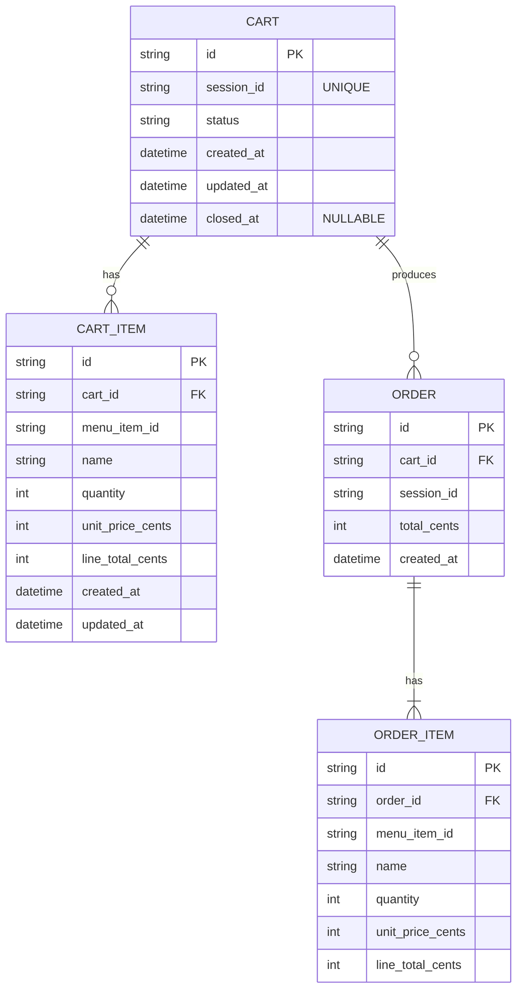

# ER-Diagram: order-bot-svc

```mermaid
erDiagram
  %% =========================
  %% order-bot-svc
  %% =========================
  CART {
    string   id PK
    string   session_id "UNIQUE"
    string   status
    datetime created_at
    datetime updated_at
    datetime closed_at "NULLABLE"
  }

  CART_ITEM {
    string   id PK
    string   cart_id FK
    string   menu_item_id
    string   name
    int      quantity
    int      unit_price_cents
    int      line_total_cents
    datetime created_at
    datetime updated_at
    %% UNIQUE(cart_id, menu_item_id)
  }

  "ORDER" {
    string   id PK
    string   cart_id FK
    string   session_id
    int      total_cents
    datetime created_at
  }

  ORDER_ITEM {
    string id PK
    string order_id FK
    string menu_item_id
    string name
    int    quantity
    int    unit_price_cents
    int    line_total_cents
  }

  CART  ||--o{ CART_ITEM : has
  CART  ||--o{ "ORDER"   : produces
  "ORDER" ||--|{ ORDER_ITEM : has


```
