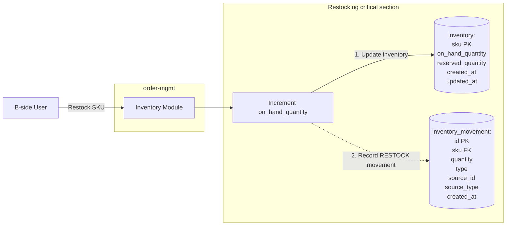
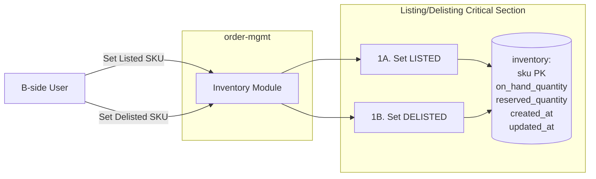

# System Diagram - Inventory

## Reduce stock after placing an order

```mermaid
flowchart LR

    subgraph CLIENTS[C-side Users]
        U1[User 1]
        U2[User 2]
        U3[User 3]
    end

    BOT[order-bot]

    subgraph OM[order-mgmt]
        ORDER[Order Module]
        INV[Inventory Module]
    end

    MQ[(Message Broker)]

    %% DB (PostgreSQL)
    ORDERS[("orders:
        id PK
        cart_id
        status
        created_at
        updated_at")]

    OUTBOX[("outbox:
        id PK
        event_type
        payload
        status
        created_at
        published_at")]

    STOCK[("inventory:
        sku PK
        on_hand_quantity
        reserved_quantity
        created_at
        updated_at")]

    RES[("inventory_reservation:
        id PK
        order_id FK
        sku FK
        quantity
        status
        created_at
        updated_at")]

    MOVEMENT[("inventory_movement:
        id PK
        sku FK
        quantity
        type
        source_id
        source_type
        created_at")]

    U1 --> BOT
    U2 --> BOT
    U3 --> BOT
    BOT -->|Submit Cart| ORDER

    ORDER -->|1. Create PENDING order| ORDERS
    ORDER ---->|2. Write OrderCreated| OUTBOX
    OUTBOX -->|3. Publish OrderCreated| MQ
    MQ -->|4. Consume OrderCreated| INV

    subgraph CS1[Inventory reservation critical section]
        INV -->|5. Try reservation| STOCK
        STOCK -->|6. Check available stock| CHECK{Enough stock?}

        CHECK -->|7A. Yes| RESERVE[Increment reserved_quantity]
        RESERVE -->|8A. Create RESERVED record| RES
        RES -->|9A. Commit / release lock| CS_OK[Reservation complete]
        CS_OK ==>|10A. Consume reservation| STOCK

        CHECK -->|7B. No| FAIL[Reservation rejected]
        FAIL -->|8B. Commit / release lock| CS_FAIL[Reservation failed]
    end


    subgraph CS2[Inventory consumption critical section]
        STOCK ==>|11A. Decrease on_hand and reserved| CONSUMED[Inventory consumed]
        CONSUMED ==>|12A. Set reservation CONSUMED| RES
        CONSUMED ==>|13A. Create SALE movement| MOVEMENT
    end

    MOVEMENT ==>|14A. Commit / release lock| INV_DONE[Inventory operation complete]

    INV_DONE -.->|15A. Publish InventoryReserved| MQ
    MQ -.->|16A. Consume InventoryReserved| ORDER
    ORDER -.->|17A. Set order CONFIRMED| ORDERS

    CS_FAIL -.->|9B. Publish InventoryRejected| MQ
    MQ -.->|10B. Consume InventoryRejected| ORDER
    ORDER -.->|11B. Set order REJECTED| ORDERS
```

## Restock

```mermaid
flowchart LR

    B[B-side User]

    subgraph OM[order-mgmt]
        INV[Inventory Module]
    end

    STOCK[("inventory:
        sku PK
        on_hand_quantity
        reserved_quantity
        created_at
        updated_at")]

    MOVEMENT[("inventory_movement:
        id PK
        sku FK
        quantity
        type
        source_id
        source_type
        created_at")]

    B -->|Restock SKU| INV

    subgraph CS[Restocking critical section]
        UPDATE[Increment on_hand_quantity]
        UPDATE -->|1. Update inventory| STOCK
        UPDATE -.->|2. Record RESTOCK movement| MOVEMENT
    end

    INV --> UPDATE
```

## Listing (Hitting on the shelves) / Delisting (Pulling from the shelves)

```mermaid
flowchart LR

    B[B-side User]

    subgraph OM[order-mgmt]
        INV[Inventory Module]
    end

    subgraph CS[Listing/Delisting Critical Section]
        SetListed[1A. Set LISTED]
        SetDeListed[1B. Set DELISTED]

        STOCK[("inventory:
            sku PK
            on_hand_quantity
            reserved_quantity
            created_at
            updated_at")]
    end

    B -->|Set Listed SKU| INV
    INV --> SetListed
    SetListed --> STOCK
    B -->|Set Delisted SKU| INV
    INV --> SetDeListed
    SetDeListed --> STOCK
```