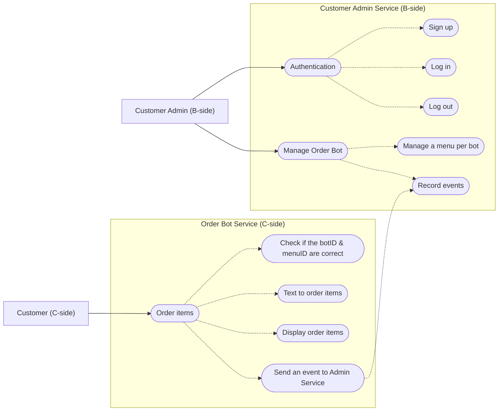

# Use Case Diagram

```mermaid
flowchart LR

  Admin["Customer Admin (B-side)"]
  Customer["Customer (C-side)"]

  direction LR

  subgraph CAS["Customer Admin Service (B-side)"]
    direction TB
    UC_Auth(["Authentication"])
    UC_Signup(["Sign up"])
    UC_Login(["Log in"])
    UC_Logout(["Log out"])
    UC_ManageBot(["Manage Order Bot"])
    UC_ImportMenu(["Manage a menu per bot"])
    UC_RecordEvents(["Record events"])
  end

  subgraph OBS["Order Bot Service (C-side)"]
    direction TB
    UC_OrderItems(["Order items"])
    UC_BotValidation(["Check if the botID & menuID are correct"])
    UC_TextToItems(["Text to order items"])
    UC_DisplayItems(["Display order items"])
    UC_SendEvent(["Send an event to Admin Service"])
  end

  Admin --> UC_Auth
  UC_Auth -.-> UC_Signup
  UC_Auth -.-> UC_Login
  UC_Auth -.-> UC_Logout
  Admin --> UC_ManageBot
  UC_ManageBot -.-> UC_ImportMenu
  UC_ManageBot -.-> UC_RecordEvents

  Customer --> UC_OrderItems

  UC_OrderItems -.-> UC_BotValidation
  UC_OrderItems -.-> UC_TextToItems
  UC_OrderItems -.-> UC_DisplayItems
  UC_OrderItems -.-> UC_SendEvent

  UC_SendEvent -.-> UC_RecordEvents

```
