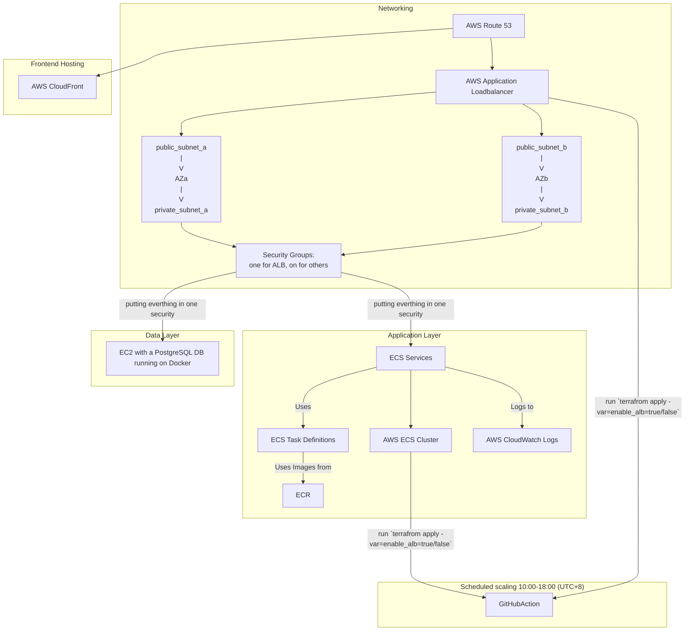
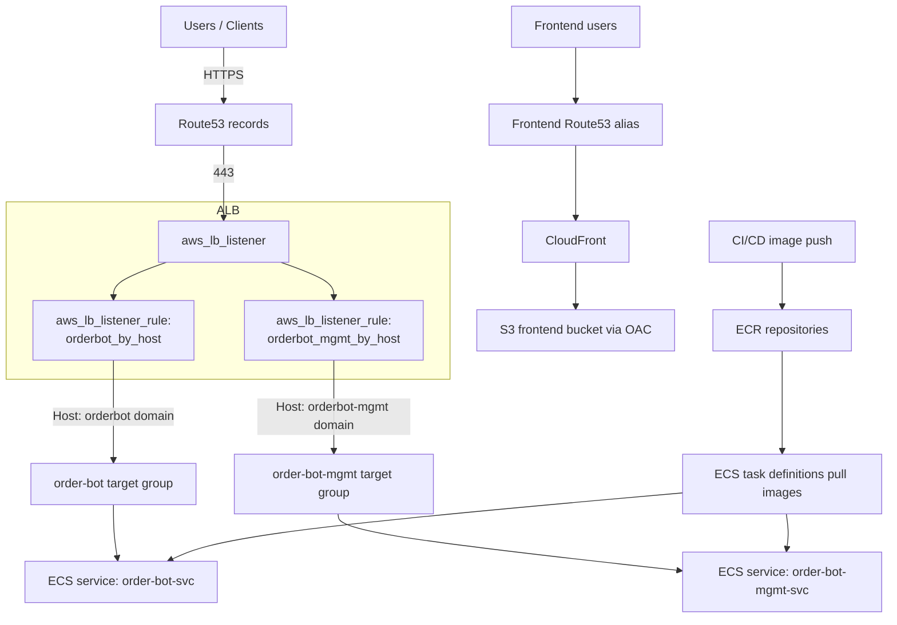

# Architecture

```mermaid
graph TD
    subgraph "Networking"
        R53[AWS Route 53] --> ALB[AWS Application Loadbalancer]
        ALB --> AZa["public_subnet_a<br>|<br>V<br>AZa<br>|<br>V<br>private_subnet_a"]
        ALB --> AZb["public_subnet_b<br>|<br>V<br>AZb<br>|<br>V<br>private_subnet_b"]
        AZa --> SG[Security Groups:<br>one for ALB, on for others]
        AZb --> SG
    end

    subgraph "Application Layer"
        SG --putting everthing in one security--> ECS_Svc[ECS Services]
        ECS_Svc --> ECS[AWS ECS Cluster]
        ECS_Svc -- Uses --> ECS_TD[ECS Task Definitions]
        ECS_TD -- Uses Images from --> ECR
        ECS_Svc -- Logs to --> CWL[AWS CloudWatch Logs]
    end

    subgraph "Data Layer"
        SG --putting everthing in one security--> EC2[EC2 with a PostgreSQL DB running on Docker]
    end

    subgraph "Frontend Hosting"
        R53 --> CF[AWS CloudFront]
    end

    subgraph "Scheduled scaling 10:00-18:00 (UTC+8)"
        ECS ----> |run `terrafrom apply -var=enable_alb=true/false`| GitHubAction
        ALB ----> |run `terrafrom apply -var=enable_alb=true/false`| GitHubAction
    end
```

```mermaid
flowchart TD
  B[Users / Clients] -->|HTTPS| C[Route53 records]
  C --443--> D[aws_lb_listener]
  subgraph "ALB"
    D
    D --> D1[aws_lb_listener_rule:<br>orderbot_by_host]
    D --> D2[aws_lb_listener_rule:<br>orderbot_mgmt_by_host]
  end
  D1 -->|Host: orderbot domain| E[order-bot target group]
  D2 -->|Host: orderbot-mgmt domain| F[order-bot-mgmt target group]
  E --> G4[ECS service: order-bot-svc]
  F --> G5[ECS service: order-bot-mgmt-svc]

  H[Frontend users] --> I[Frontend Route53 alias]
  I --> J[CloudFront]
  J --> K[S3 frontend bucket via OAC]

  L[CI/CD image push] --> M[ECR repositories]
  M --> N[ECS task definitions pull images]
  N --> G4
  N --> G5
```
