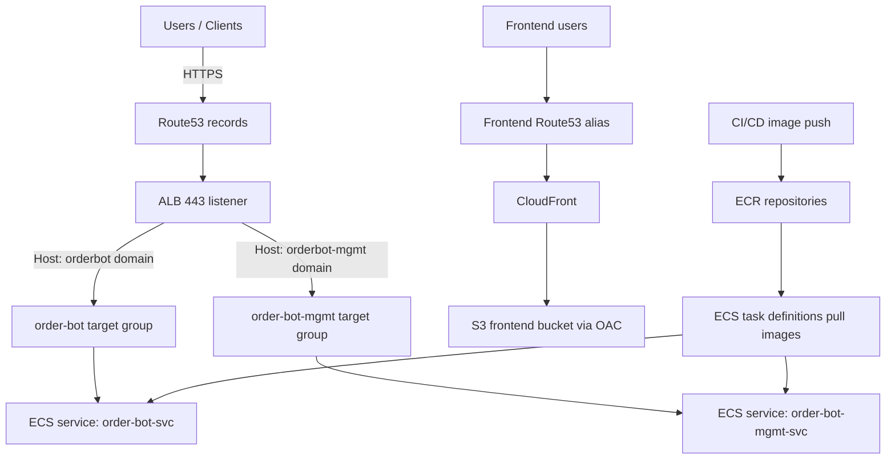

# Architecture mapping

This Terraform implementation follows the provided Mermaid diagram and the discovered app behavior:

- **Frontend (`order-bot-frontend`)** expects:
  - `VITE_ORDER_BOT_BASE_PATH` for chat API
  - `VITE_ORDER_BOT_MGMT_BASE_PATH` for management API
- **Chat service (`order-bot-svc`)**:
  - FastAPI app with `/chat` endpoints and menu lookups.
  - Runtime configured via env vars (`HOST`, `PORT`, `DATABASE_URL`, etc.).
- **Management service (`order-bot-mgmt-svc`)**:
  - Gin app under `/orderbotmgmt` plus `/health`.
  - Runtime configured via env vars (`ADDRESS`, `PORT`, `BLUEPRINT_DB_*`, etc.).

## Diagram-to-resource translation

- Route53 -> ALB for API domains (`chat`, `mgmt`) in `environments/prod`.
- Route53 -> CloudFront -> S3 for frontend domain in `environments/global`.
- ALB across two public subnets/AZs (input-driven).
- ECS services and PostgreSQL EC2 are assumed to share one app SG.
- ECS task definitions use ECR images and ship logs to CloudWatch Logs.
- Scheduled autoscaling sets desired capacity to 1 during 10:00-18:00 and allows 0 outside that window.

## Gaps and assumptions

- PostgreSQL EC2 instance provisioning is intentionally external to keep module list aligned with the request; DB host is injected via environment variables.
- Existing VPC/subnets/hosted zone/certificates are expected as inputs.
