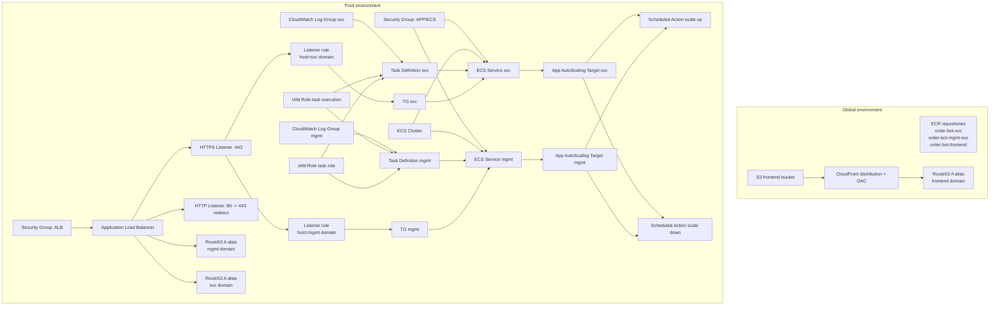

# Infra Start Flow (from `main.tf`/`output.tf`)

This document summarizes the startup/runtime flow and all Terraform resources discovered by recursively reading every `main.tf` and `output.tf` under `infra-terraform`.

> Note: No `output.tf` files were found in the current tree; the summary below is based on `main.tf` files only.

## Mermaid start flow

## Resource inventory by file

## `environments/global/main.tf`
- `module.ecr` (module `../../modules/ecr`)
  - Creates ECR repositories and lifecycle policies for three images.
- `module.frontend` (module `../../modules/s3`)
  - Provisions frontend static hosting stack: S3 + CloudFront + Route53 alias.

## `environments/prod/main.tf`
- `module.security_group` (module `../../modules/security_group`)
  - ALB security group (ingress 80/443 from configured CIDRs).
  - App security group (app port from ALB SG, self-ingress 5432, egress all).
- `module.alb` (module `../../modules/alb`)
  - ALB, target groups, listeners, and host-based listener rules.
- `aws_route53_record.orderbot_mgmt_alias`
  - DNS alias from management domain to ALB.
- `aws_route53_record.orderbot_alias`
  - DNS alias from service domain to ALB.
- `module.ecs` (module `../../modules/ecs`)
  - ECS cluster, task defs, services, CloudWatch logs, IAM task roles, autoscaling targets.
- `module.schedule` (module `../../modules/schedule`)
  - Time-based scale-up/scale-down scheduled actions for both ECS services.

## `modules/ecr/main.tf`
- `aws_ecr_repository.this` (for each repository name)
- `aws_ecr_lifecycle_policy.this` (for each repository)

## `modules/s3/main.tf`
- `aws_s3_bucket.frontend`
- `aws_s3_bucket_public_access_block.frontend`
- `aws_cloudfront_origin_access_control.this`
- `aws_cloudfront_distribution.this`
- `aws_s3_bucket_policy.frontend` (CloudFront OAC read access)
- `aws_route53_record.frontend_alias`

## `modules/security_group/main.tf`
- `aws_security_group.alb`
- `aws_security_group.app`

## `modules/alb/main.tf`
- `aws_lb.this`
- `aws_lb_target_group.orderbot`
- `aws_lb_target_group.orderbot_mgmt`
- `aws_lb_listener.https`
- `aws_lb_listener.http_redirect`
- `aws_lb_listener_rule.orderbot_mgmt_by_host`
- `aws_lb_listener_rule.orderbot_by_host`

## `modules/ecs/main.tf`
- Data sources:
  - `data.aws_region.current`
  - `data.aws_caller_identity.current`
  - `data.aws_iam_policy_document.ecs_task_assume`
- Logging:
  - `aws_cloudwatch_log_group.svc`
  - `aws_cloudwatch_log_group.mgmt`
- ECS/IAM:
  - `aws_ecs_cluster.this`
  - `aws_iam_role.task_execution`
  - `aws_iam_role_policy_attachment.task_exec_default`
  - `aws_iam_role.task_role`
  - `aws_ecs_task_definition.svc`
  - `aws_ecs_task_definition.mgmt`
  - `aws_ecs_service.svc`
  - `aws_ecs_service.mgmt`
- Auto scaling targets:
  - `aws_appautoscaling_target.svc`
  - `aws_appautoscaling_target.mgmt`

## `modules/schedule/main.tf`
- `aws_appautoscaling_scheduled_action.scale_up` (for each ECS service)
- `aws_appautoscaling_scheduled_action.scale_down` (for each ECS service)

## End-to-end startup sequence
1. **Base registries and frontend edge** are created in the global environment (ECR + S3/CloudFront/DNS).
2. **Prod networking guardrails** come up (ALB SG and app SG).
3. **ALB routing plane** is created (ALB, listeners, host rules, target groups).
4. **DNS for backend domains** is aliased to the ALB.
5. **ECS control/data plane** is provisioned (cluster, IAM roles, task definitions, services).
6. **Service registration to ALB target groups** connects host-based ingress to ECS tasks.
7. **Autoscaling controls** are attached (scalable targets), then **scheduled actions** drive day/night desired counts.
