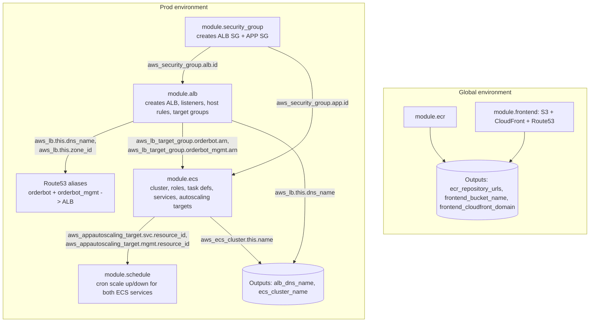

# Terraform Start Flow and Resource Inventory

This document summarizes what is created from all `main.tf` and `outputs.tf` files under `infra-terraform`, and the high-level startup/runtime flow between resources.

## 1) Root environment composition

There are two environment entry points:

- `environments/global`: shared/global resources (ECR + frontend hosting).
- `environments/prod`: runtime resources for production API services (Security Groups + ALB + ECS + scheduled scaling + DNS).

## 2) `terraform apply`: end-to-end start flow

```mermaid
flowchart TD
  subgraph G[Global environment]
    direction TB
    G1[module.ecr]
    G2[module.frontend: S3 + CloudFront + Route53]
    G3[(Outputs: ecr_repository_urls, frontend_bucket_name, frontend_cloudfront_domain)]
    G1 --> G3
    G2 --> G3
  end

  subgraph P[Prod environment]
    direction TB
    P1["module.security_group<br/>creates ALB SG + APP SG"]
    P2["module.alb<br/>creates ALB, listeners, host rules, target groups"]
    P3["Route53 aliases<br/>orderbot + orderbot_mgmt -> ALB"]
    P4["module.ecs<br/>cluster, roles, task defs, services, autoscaling targets"]
    P5["module.schedule<br/>cron scale up/down for both ECS services"]
    P6[(Outputs: alb_dns_name, ecs_cluster_name)]

    P1 --aws_security_group.alb.id--> P2
    P2 --aws_lb.this.dns_name,<br>aws_lb.this.zone_id--> P3
    P1 --aws_security_group.app.id--> P4
    P2 --aws_lb_target_group.orderbot.arn,<br>aws_lb_target_group.orderbot_mgmt.arn--> P4
    P4 --aws_appautoscaling_target.svc.resource_id,<br>aws_appautoscaling_target.mgmt.resource_id--> P5
    P2 --aws_lb.this.dns_name--> P6
    P4 --aws_ecs_cluster.this.name--> P6
  end
```