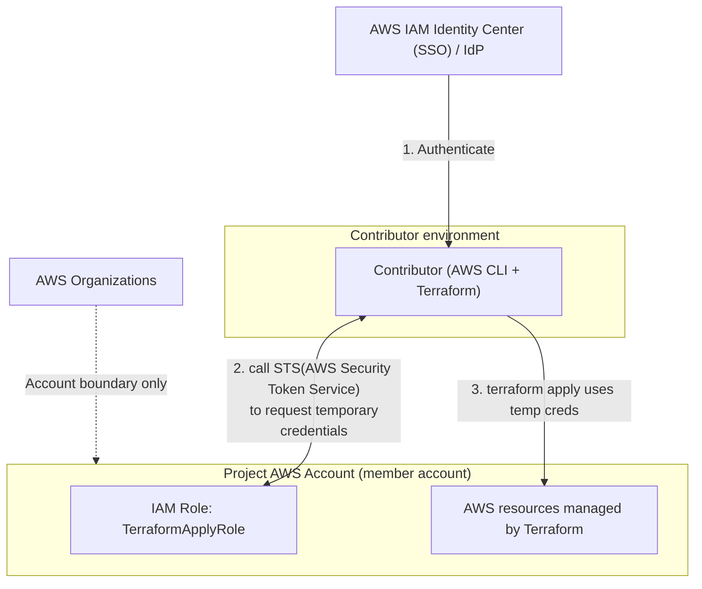
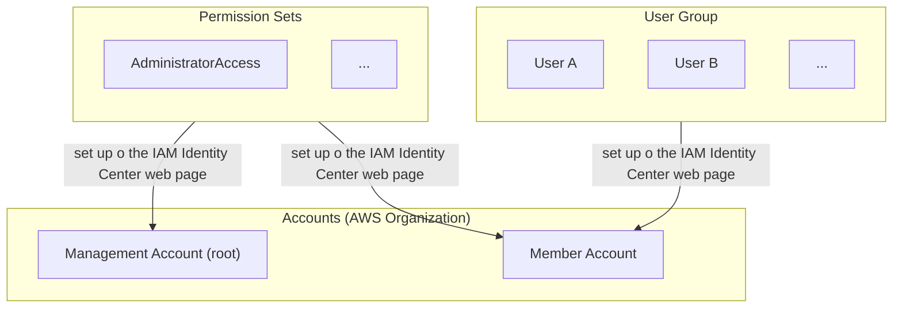

# Terraform AWS IAM wiring (parent + sub-accounts)

## Diagrams





## Step-by-step Setup

## 1) Create the Organization and the Project Account

1. In the **management account**, enable **AWS Organizations**.
2. Create **one member account per project**, e.g. `project-foo`.

Outcome:

* `project-foo` is isolated: IAM policies/resources are cleaner and safer.

---

### 2) Enable IAM Identity Center (AWS SSO)

1. In the **management account**, enable **IAM Identity Center**.
2. Choose an identity source:

  * Identity Center built-in directory (simple), or
  * External IdP (Google Workspace / Azure AD / Okta), if you have it.

---

### 3) Create a Group and Add Users

1. Create an **Identity Center Group**:

  * `project-foo-devs`
2. Add users to this group.

This is the “many users share the same group” part.

---

### 4) Create a Permission Set for Terraform Apply

Create a **Permission Set** like `ProjectFooApply`.

What permissions should it include?

* Permissions to manage the resources Terraform touches (**least privilege** if you can).
* If you’re early-stage and want speed: start broad, then tighten later.

Common initial approaches:

* **AdminAccess** (fast but risky)
* A scoped policy for only that project’s services (better, more work)

---

### 5) Assign the Permission Set to the Project Account

Assign:

* Group: `project-foo-devs`
* Account: `project-foo`
* Permission Set: `ProjectFooApply`

Outcome:

* Identity Center will create a role in the project account (SSO-managed role).
* Users can assume it via SSO and get **temporary credentials**.

---

## Wiring Terraform to AWS (SSO)

Terraform itself doesn’t “connect to an Organization” or “connect to a group”.
Terraform uses AWS creds from:

* environment variables, or
* AWS shared config/credentials files, or
* an execution environment (CI role), etc.

With SSO, the simplest is: **AWS CLI SSO profile → Terraform uses that profile**.

---

### Local workflow (developer laptop)

#### 1) Configure AWS CLI SSO profile

```bash
aws configure sso
# Creates a profile in ~/.aws/config
```

#### 2) Login

```bash
aws sso login --profile project-foo
```

#### 3) Run Terraform using that profile

```bash
export AWS_PROFILE=project-foo
terraform init
terraform plan
terraform apply
```

#### Terraform provider example

```hcl
provider "aws" {
  region  = "ap-northeast-1"
  profile = "project-foo"
}
```

That’s enough if the SSO role already has the permissions you need.

---

## Backend State (You must handle this)

For `terraform apply` to work, the user also needs access to the **Terraform state backend**, commonly:

* S3 bucket (state)
* DynamoDB table (state locking)
* KMS key (if the bucket uses SSE-KMS)

Two common patterns:

#### Pattern A: Backend in the SAME project account

* Simplest.
* The SSO role just needs S3/DDB/KMS access in that account.

#### Pattern B: Backend in a SHARED “tooling” account

* Cleaner when you have many project accounts.
* But you’ll need either:

  * cross-account access to the shared state bucket/table, or
  * separate roles/profiles for backend vs apply (more complex)

If you’re trying to reduce mess, Pattern A is usually easiest for side projects.

---

## CI workflow (recommended for real teams)

Instead of letting humans run `apply`, you often do:

* humans run `plan`
* CI runs `apply` (after approval)

In that case:

* CI assumes a role in the project account (still “Option B”, just non-human)
* no local credentials needed for apply
