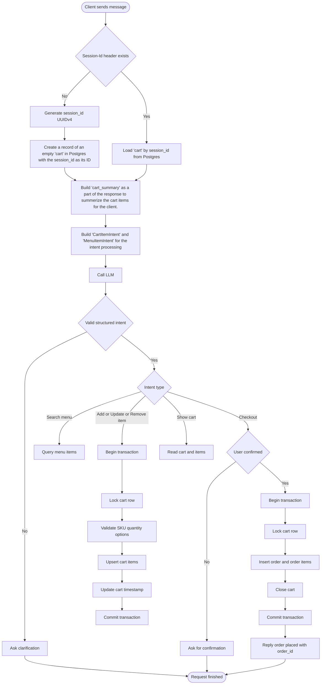

```mermaid
    flowchart TD
        A([Client sends message])
        B{Session-Id header exists}

        A --> B

        B -->|No| C[Generate session_id UUIDv4]
        C --> D[Create a record of an empty 'cart' in Postgres with the session_id as its ID]

        B -->|Yes| E[Load 'cart' by session_id from Postgres]

        F[Build 'cart_summary' as a part of the response to summerize the cart items for the client.]
        D --> F
        E --> F

        F --> G[Build 'CartItemIntent' and 'MenuItemIntent' for the intent processing]
        G --> H[Call LLM]

        H --> I{Valid structured intent}

        I -->|No| J[Ask clarification]
        J --> Z([End request])

        I -->|Yes| K{Intent type}

        K -->|Search menu| L[Query menu items]

        K -->|Add or Update or Remove item| M[Begin transaction]
        M --> N[Lock cart row]
        N --> O[Validate SKU quantity options]
        O --> P[Upsert cart items]
        P --> Q[Update cart timestamp]
        Q --> R[Commit transaction]

        K -->|Show cart| S[Read cart and items]

        K -->|Checkout| T{User confirmed}

        T -->|No| U[Ask for confirmation]
        U --> Z

        T -->|Yes| V[Begin transaction]
        V --> W[Lock cart row]
        W --> X[Insert order and order items]
        X --> Y[Close cart]
        Y --> AA[Commit transaction]
        AA --> AB[Reply order placed with order_id]

        AB --> Z

        Z([Request finished])
```